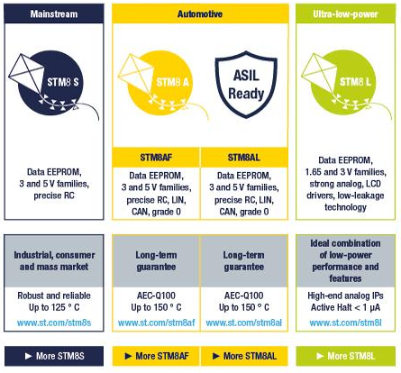

# [STM8](https://github.com/mcuyun/STM8) 

 

####  qitas@qitas.cn

#### 近似：[MCS-51](https://github.com/sochub/MCS-51) 
#### 工具：[IAR STM8](https://www.iar.com/iar-embedded-workbench/#!?architecture=STM8&currentTab=overview) 

## [简介](https://github.com/sochub/STM8/wiki)

STM8单片机，8位微控制器平台基于高性能8位内核和先进外设集，STM8专有内核具有3级流水线的哈佛结构，在8位单片机行业中占据着举足轻重的市场地位。

 

#### [STM8L](https://github.com/mcuyun/STM8L) 

STM8单片机低功耗系列，与STM32L系列一样采用了专有超低漏电流工艺，利用最低功耗模式实现了超低功耗（0.30 uA）。

#### [STM8S](https://github.com/mcuyun/STM8S) 

STM8单片机通用系列，采用ST的130纳米工艺技术和先进内核架构，主频达到24 MHz，处理能力高达20MIPS。

##  [SoC开发平台](http://www.qitas.cn)  

